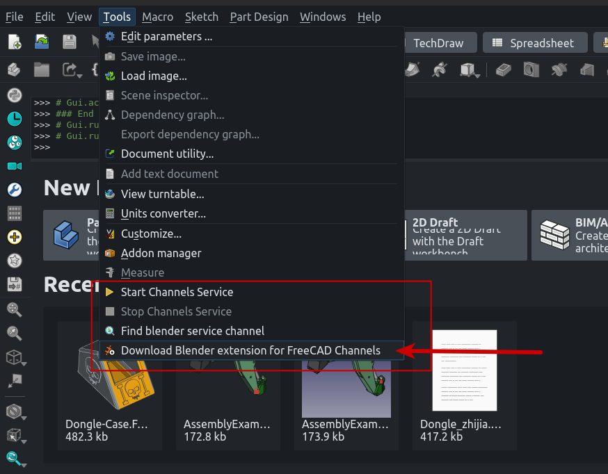
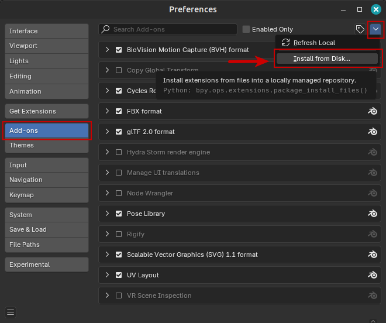
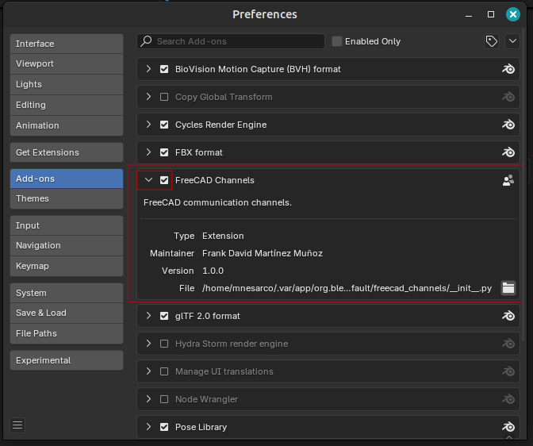
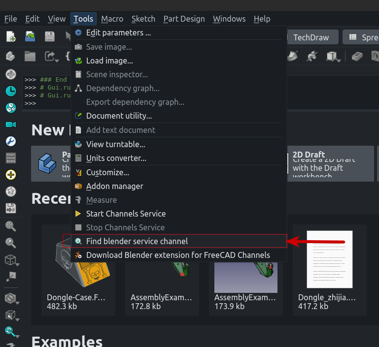
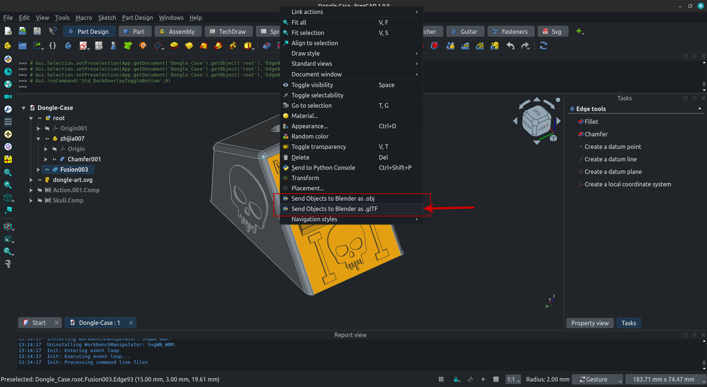
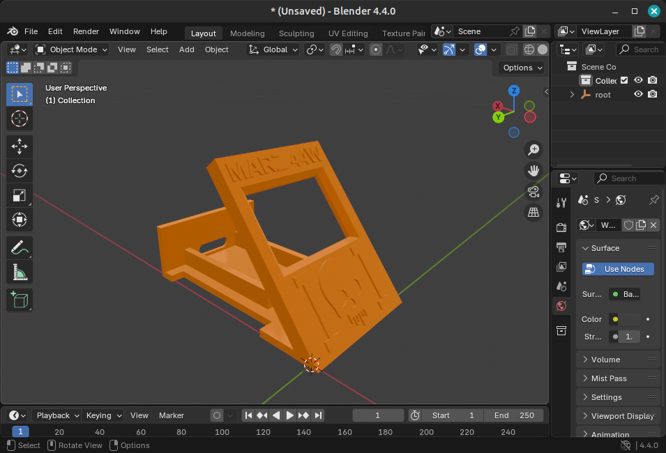

# FreeCAD Channels

This Add-On provides a service to interconnect FreeCAD with external programs
using tcp connections.

## Features

1. Zeroconf-like autodiscovery of channels (Services)
2. Declarative service declarations on both sides
3. Two way communications but fully asynchronous
4. Built-in FreeCAD-Blender Channel.

## Todo

1. Define commands to expose as services to external programs

## Status

This Add-on is in very alpha state.

## Install

### Manual install

Download as a zip file and unzip un your FreeCAD's user `Mod` dir.

## Docs

TODO

## Basic usage

When the addon is installed, some commands are added to the `Tools` menu
from there you can download the Blender extension to install in your
own blender installation. Then you can send objects to it using the
context menu.

Save the extension zip file where ever you want, then go to Blender and install it:

Once installed, the extension can be activated or deactivated in blender.

Now you are ready to go. First in FreeCAD use the tools menu to find the Blender service:
Finding the Blender service is optional as it will be descovered on first use, but doing
it allows you to verify that everything is working.

Now you can send objects to Blender using the context menu:

Then your Blender scene gets updated:

# Known Issues

1. .obj scaling differs from .gltf scaling.
2. .gltf works well with FreeCAD 1.0 but fails with 1.1 because there is an unsolved BUG in FreeCAD right now with colors/materials at export: https://github.com/FreeCAD/FreeCAD/issues/20621
3. When the FreeCAD bug gets resolved, it is expected that the usage of .obj format is no longer needed as gltf provides more information.
4. This has been tested only on Linux, reports from Mac/Windows will be appreciated.
